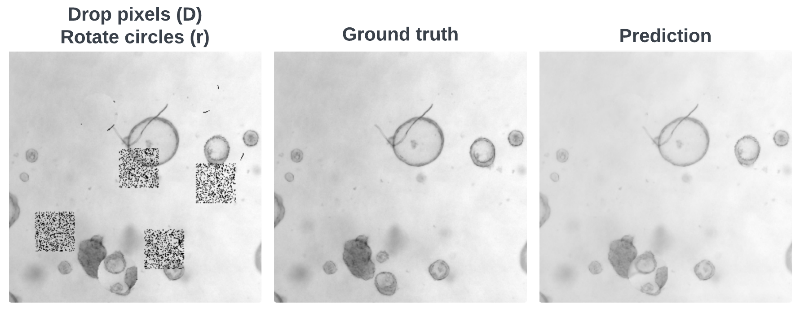

# Organoid Segmentation Using Self-Supervised Learning: How Complex Should the Pretext Task Be?
Code repository for the conference paper ["Organoid Segmentation Using Self-Supervised Learning: How Complex Should the Pretext Task Be?"](https://doi.org/10.1145/3637732.3637772) published and presented at the [International Conference on Biomedical and Bioinformatics Engineering (ICBBE)](https://www.icbbe.com/) [2023](https://dl.acm.org/doi/proceedings/10.1145/3637732).

## Setup
The usage of a virtual environment is recommended. To install all dependencies, run:
```
pip install --upgrade pip setuptools wheel
pip install -r requirements.txt
```

Dataset can be downloaded from [OrganelX](https://organelx.hpc.rug.nl/organoid/). Folder structure should be:
```
organoid_data/
organoid_data/1CA5KMCR7K7MT53OS7FG/
etc.
```
Repository contains dummy dataset to test functionality.

## Usage
As described in the paper, training is divided into pretext training and downstream training.
### Pretext


Pretext training can be done using:
```
python train_pretext.py --task1=[task option] [--task2=[task option]] [--dummy True]
```

Testing of pretext trained models can be done using:
```
python test_pretext.py --task1=[task option] [--task2=[task option]] [--dummy True]
```
`[task option]` consists of `{b,d,s,r,B,D,S,R,j,p}` and represents the different self prediction/ innate relationship pretext tasks. Self prediction pretext tasks can be combined by specifying the second task `--task2` as well.

`--dummy True` specifies the use of the dummy data set rather than the actual data set. Default is set to `False`.

### Downstream

Note: testing of the pretext trained models should be done before downstream training as the best pretext model is used for downstream training.

Downstream training can be done using:
```
python train_downstream.py --task1=[task option] [--task2=[task option]] [--dummy True]
```

Testing of downstream trained models can be done using:
```
python test_downstream.py --task1=[task option] [--task2=[task option]] [--dummy True]
```
`[task option]` consists of `{b,d,s,r,B,D,S,R,j,p}` and represents the different self prediction/ innate relationship pretext tasks. Self prediction pretext tasks can be combined by specifying the second task `--task2` as well.

`--dummy True` specifies the use of the dummy data set rather than the actual data set. Default is set to `False`.
